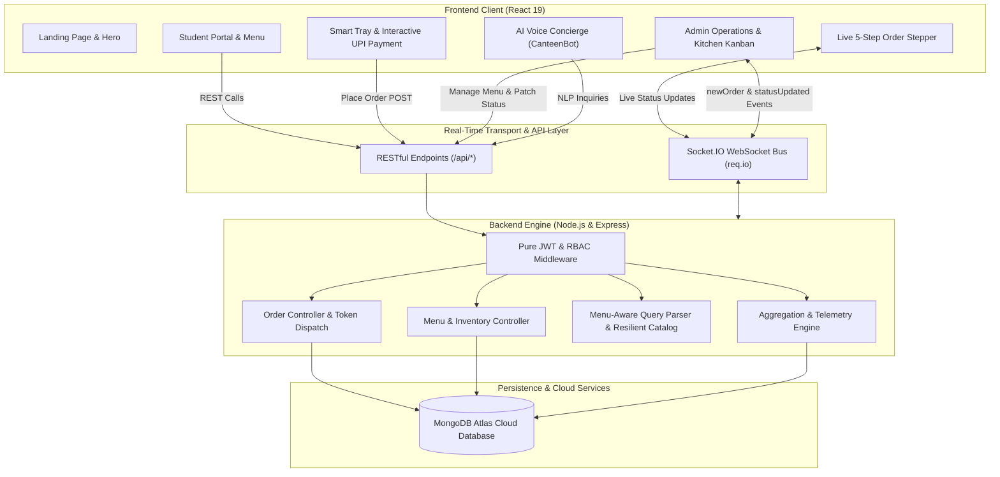

# 🍽️ Campus Canteen Management System (SREC Canteen)
> **An enterprise-grade, real-time campus dining & order orchestration platform engineered with modern full-stack best practices.**

[](https://react.dev/)
[](https://nodejs.org/)
[](https://www.mongodb.com/)
[](https://socket.io/)
[](https://jwt.io/)
[](LICENSE)

---

## 🌟 Executive Summary & Recruiter Highlights

The **Campus Canteen Management System** modernizes campus dining lines into an ultra-responsive, contactless ordering experience. Built with an event-driven architecture powered by **Node.js, Express, MongoDB Atlas, React 19, and Socket.IO**, this platform bridges the gap between students, counter attendants, and kitchen chefs with sub-second order dispatch and live kitchen Kanban orchestration.

### 🏆 Key Technical Achievements:
- ⚡ **Bi-Directional Real-Time Event Engine**: Full Socket.IO integration syncing student orders to kitchen staff displays instantly without polling. Real-time notifications and visual alerts.
- 💳 **Authentic & Interactive UPI Payment Flow**:
  - Dynamic UPI QR Code generated in-browser matching NPCI UPI standards (`upi://pay?pa=...`).
  - 1-Click UPI Apps selector supporting **Google Pay, PhonePe, Paytm, and BHIM UPI**.
  - Direct VPA ID input field with format verification.
  - Realistic 15-second countdown simulated approval modal with an **Instant 1-Click Approval** bypass for recruiters and testers.
  - Dual-tone synthesizer payment success chime powered by the native browser **Web Audio API**.
  - Automatic transition to digital FSSAI-compliant pickup receipt with order token.
- 🔐 **Pure JWT Authentication**:
  - Completely self-contained stateless authentication via JSON Web Tokens (JWT) and salted Bcrypt password hashing.
  - Zero external third-party SDK dependencies (no Firebase required).
  - 1-Click Demo Login helpers for both Student and Admin roles for immediate evaluation.
- 🤖 **Voice-Enabled AI Canteen Concierge (CanteenBot)**:
  - Smart menu assistant answering budget queries (*"What's under ₹50?"*), dietary preferences (*"Pure Veg"*), and daily specials.
  - In-browser speech synthesis (**Web Speech API**) and voice recognition.
  - Resilient design: runs with an intelligent in-memory fallback catalog to guarantee zero connection failures even if the network fluctuates.
- 📋 **Kitchen Kanban Board**: Real-time order pipeline enabling cooks to accept, cook, mark ready, and dispatch meals with single-click status updates reflecting immediately on the student's live 5-step status stepper.
- 📊 **Executive Analytics & KPI Dashboard**: Real-time sales telemetry, dynamic revenue trend charts (Chart.js), category breakdown donuts, and automated CSV audit logging.
- 🛡️ **Hardened Backend Infrastructure**: DNS resolver failover for MongoDB Atlas on Windows environments, role-based access control (RBAC), and sanitization middleware.

---

## 🏗️ Architecture & System Design



---

## 🎯 Role-Based Portals & Feature Matrix

| Feature Module | Student / Customer Portal | Kitchen & Admin Operations Panel |
|---|---|---|
| **Authentication** | 1-Click Demo Login, Pure JWT sign-in / registration | Protected `/adminlogin` with JWT + RBAC protection |
| **Menu Browsing** | Category chips, instant search, Veg filter, price sort | Instant in-stock/out-of-stock toggle, dish CRUD modal |
| **Ordering Flow** | Counter Pickup vs Dine-In Table service, cooking notes | Live Kanban Board (Pending ➔ Confirmed ➔ Cooking ➔ Ready ➔ Completed) |
| **Payment Flow** | Dynamic UPI QR, GPay/PhonePe/Paytm/BHIM grid, VPA check, audio chime | Real-time payment verification and instant token dispatch |
| **AI Concierge** | Voice recognition, SpeechSynthesis TTS, budget meal finder | Automatic meal queries, zero-crash fallback catalog |
| **Tracking** | Live 5-Step Animated Progress Stepper with auto-refresh | Live audio chime notification on incoming student orders |
| **Receipts** | Printable digital token bill with GST breakdown & QR code | Revenue aggregation, 7-day sales trend, CSV audit export |

---

## 🚀 Quickstart Guide: How to Run the Project

### Prerequisites
- [Node.js](https://nodejs.org/) (v16.0.0 or higher installed)
- [Git](https://git-scm.com/)
- An active internet connection (for cloud MongoDB Atlas connection)

---

### Step 1: Clone the Repository
```bash
git clone https://github.com/Lishanthraa-cse/Canteen-Managment-System.git
cd "Canteen Managment System"
```

---

### Step 2: Backend Setup & Launch

1. Navigate to the `backend` folder and install dependencies:
```bash
cd backend
npm install
```

2. (Optional) Initialize Admin Account or Seed Menu Items:
```bash
# To create/verify the default admin user:
npm run create-admin

# To seed authentic campus menu items:
npm run seed
```

3. Start the Backend Server:
```bash
npm start
```
*The server will start on `http://localhost:5000` with confirmation `✅ MongoDB Atlas Connected Successfully`.*

---

### Step 3: Frontend Setup & Launch

1. Open a **new terminal window**, navigate to the `my-react-app` directory and install dependencies:
```bash
cd my-react-app
npm install
```

2. Start the React development server:
```bash
npm start
```
*The application will launch in your default browser at `http://localhost:3000`.*

---

## 🔑 Demo Credentials (For Immediate Evaluation)

Frictionless 1-click login buttons are embedded directly on both login pages for recruiter convenience:

### Admin / Kitchen Operations Portal:
- **URL**: `http://localhost:3000/adminlogin`
- **Email**: `admin@srec.ac.in`
- **Password**: `admin123`
- *(Or click the green **"Auto-Fill Demo Credentials"** button on the screen)*

### Student / Customer Portal:
- **URL**: `http://localhost:3000/login`
- *(Click the blue **"1-Click Student Demo Access"** button to explore as Priya - SREC Student)*

---

## 📡 RESTful API Reference

| Method | Endpoint | Access | Description |
|---|---|---|---|
| `POST` | `/api/login` | Public | Student JWT sign-in |
| `POST` | `/api/register` | Public | Student account registration |
| `POST` | `/api/admin/login` | Public | Admin & staff authentication with JWT |
| `GET` | `/api/menu` | Public | List all active dishes with category & veg filters |
| `POST` | `/api/menu` | Admin (JWT) | Create a new dish with prep time, price, category |
| `PUT` | `/api/menu/:id` | Admin (JWT) | Edit an existing menu item |
| `PATCH`| `/api/menu/:id/toggle` | Admin (JWT) | 1-Click stock availability toggle |
| `DELETE`| `/api/menu/:id` | Admin (JWT) | Remove dish from menu |
| `POST` | `/api/order` | Public/User | Place order, assign token `#ORD-XXXX`, broadcast to kitchen |
| `GET` | `/api/order` | Admin (JWT) | Fetch active orders for Kitchen Kanban board |
| `PATCH`| `/api/order/:id/status`| Admin (JWT) | Transition order lifecycle (Emits Socket.IO update) |
| `GET` | `/api/order/track/:id` | Public | Retrieve real-time progress for token/order |
| `POST` | `/api/chatbot` | Public | AI Concierge menu queries with voice support |
| `GET` | `/api/admin/dashboard-stats` | Admin (JWT) | Revenue analytics, today's volume, category breakdown |
| `GET` | `/api/admin/logs` | Admin (JWT) | Security audit trail with CSV download |

---

## 🛠️ Technology Stack Breakdown

| Layer | Technologies Used | Rationale & Architectural Purpose |
|---|---|---|
| **Frontend Framework** | React 19, React Router v7 | Component-driven UI, zero-dependency state management via React Context API |
| **Styling & UI** | Modern CSS, Bootstrap 5, React Icons | Clean, responsive modern campus aesthetic optimized across mobile, tablet, and desktop |
| **Payment Simulation** | Dynamic QR (`qrcode.react`), Web Audio API | Interactive UPI payment flow with NPCI-compatible URI, app selectors, audio chime |
| **Real-Time Layer** | Socket.IO Client 4.8 | Bidirectional WebSockets for instantaneous kitchen-counter synchronization |
| **Data Visualization** | Chart.js 4.4, React-ChartJS-2 | High-performance canvas charting for daily revenue curves and sales insights |
| **Voice & AI** | Browser Web Speech API + SpeechSynthesis | Zero-latency, in-browser conversational concierge without heavy external python dependencies |
| **Backend Framework** | Node.js, Express.js | Non-blocking asynchronous I/O with modular routing and unified error handling |
| **Database** | MongoDB Atlas Cloud, Mongoose ODM | Flexible document storage with schema validation, indexing, and auto-token generators |
| **Authentication** | Pure JSON Web Tokens (JWT), Bcrypt.js | Stateless signed claims with encrypted credentials and password protection |

---
